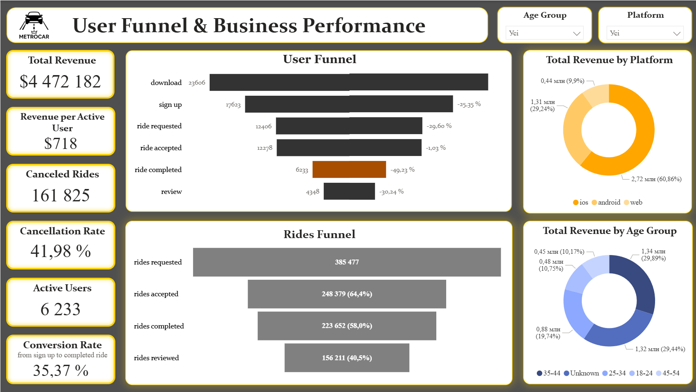
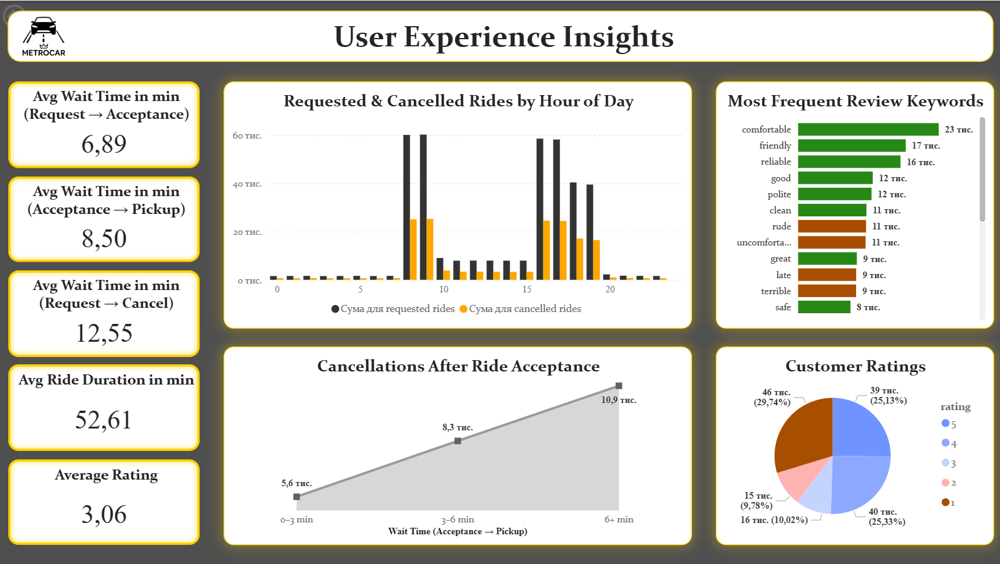

# MetroCar User Funnel Analysis

## Project Overview
MetroCar is a ride-hailing platform where users can download the app, sign up, request and complete rides, make payments, and leave reviews.

This project explores the full user funnel to understand customer behavior, identify performance bottlenecks, and provide actionable recommendations to improve conversion, retention, and user experience.

## Business Objectives
The analysis focused on four main goals:

1. **Build the User Funnel**  
   Define each stage of the customer journey — Download → Signup → Ride Request → Acceptance → Ride Completion → Payment → Review — and calculate conversion rates between stages.

2. **Identify Drop-off Points**  
   Detect the weakest funnel stages and investigate possible reasons behind user churn.

3. **Evaluate Platform Performance**  
   Compare engagement, conversion, and revenue across Android, iOS, and Web platforms.

4. **Analyze User Demographics**  
   Understand which age groups are the most active, engaged, and valuable.

## Data Sources
The project was built using several datasets representing different stages of the MetroCar user journey:

- **app_downloads** — app installations and platform type
- **signups** — user registrations with age group and session identifiers
- **ride_requests** — request, acceptance, pickup, and cancellation timestamps
- **transactions** — completed rides and purchase amount
- **reviews** — user ratings and written feedback

### Data Model
The datasets were joined using the following keys:

- **user_id** — links signups, ride requests, and reviews
- **ride_id** — connects ride requests, transactions, and reviews
- **session_id / app_download_key** — links app downloads with signups

## Tools Used
- **SQL (DBeaver / PostgreSQL)** — data extraction, cleaning, joins, aggregations
- **Excel** — validation, pivot tables, intermediate calculations, exploratory charts
- **Power BI** — dashboard development, KPI tracking, and interactive reporting

## Key Metrics
- **Total Revenue:** $4.47M
- **Active Users:** 6,233
- **Conversion Rate (Sign-up → Completed Ride):** 35.37%
- **Cancellation Rate:** 41.98%
- **Average Rating:** 3.06 / 5
- **Average Ride Duration:** 52.6 minutes
- **Average Wait Time (Request → Acceptance):** 6.89 min
- **Average Wait Time (Acceptance → Pickup):** 8.50 min
- **Average Wait Time (Request → Cancel):** 12.55 min

## Key Insights

### 1. Funnel Drop-off
The most significant drop-off occurred between **ride accepted** and **ride completed**, where nearly half of users abandoned the journey after acceptance.  
This suggests issues related to wait times, driver reliability, or communication during pickup.

### 2. Cancellations and Wait Time
Ride cancellations were strongly connected to long wait times.

- Cancellations peaked during **morning and evening rush hours**
- When pickup wait time exceeded **6 minutes**, cancellations increased sharply
- Most cancellations happened after users waited **more than 10 minutes**

This points to a supply-demand imbalance and operational bottlenecks.

### 3. Driver Availability
Driver activity analysis showed that most drivers completed only a small number of rides, which may indicate low engagement or limited availability.  
This likely contributed to longer wait times and higher cancellation rates.

### 4. Platform Performance
Among all platforms, **iOS** showed the strongest performance:

- Highest number of ride requests
- Highest number of completed rides
- Highest total revenue contribution

The Web platform had the weakest engagement and revenue performance.

### 5. Demographic Insights
Users aged **35–44** generated the highest share of revenue and showed the strongest engagement.  
The large **Unknown** age segment also contributed significantly, indicating a gap in demographic data collection.

### 6. Customer Feedback
Review analysis showed a mix of positive and negative experiences.

Most frequent positive keywords included:
- comfortable
- friendly
- reliable

Recurring negative keywords included:
- rude
- late
- uncomfortable
- terrible

Customer ratings were also mixed, with a noticeable share of low ratings, suggesting inconsistent service quality.

## Recommendations
Based on the analysis, the following actions were recommended:

1. Improve driver allocation and dispatching to reduce wait times
2. Increase driver engagement, especially during peak demand hours
3. Improve in-app communication around driver arrival and delays
4. Launch retention and reactivation campaigns for active and churned users
5. Focus marketing efforts on high-value segments such as iOS users and users aged 35–44
6. Improve onboarding and accessibility for underrepresented age groups
7. Encourage users to provide demographic information during registration
8. Monitor reviews and ratings more systematically to identify recurring service issues

## SQL Analysis Included
The SQL part of the project covered:

- User funnel drop-off analysis
- Funnel summaries by platform and age group
- Ride activity and revenue by platform and age group
- Ride cancellations by day, hour, and wait time
- Cancellations after ride acceptance
- Average wait times and ride duration metrics
- Review keyword frequency analysis
- Driver activity distribution
- Customer rating distribution

## Repository Contents
- `MetroCar_User_Funnel_Analysis_report.pdf` — final project report
- `MetroCar_SQL_queries.pdf` — SQL queries used for extraction and analysis
- `MetroCar.xlsx` — Excel file with validation, pivot tables, additional calculations, and charts
- `MetroCar_Dashboard_page_1.png` — Power BI dashboard preview, page 1
- `MetroCar_Dashboard_page_2.png` — Power BI dashboard preview, page 2
- `MetroCar_Dashboard.pbix` — Power BI dashboard file

## Dashboard Preview

The final Power BI dashboard consists of two pages and provides an interactive view of MetroCar’s funnel performance, business outcomes, and user experience patterns.

### Page 1 — User Funnel & Business Performance
This page focuses on the overall funnel and business performance of the platform. It includes:
- key KPI cards such as total revenue, revenue per active user, cancelled rides, cancellation rate, active users, and conversion rate
- a user funnel showing progression from download to review and highlighting the biggest drop-off point
- a rides funnel showing the conversion from requested to completed and reviewed rides
- revenue distribution by platform
- revenue distribution by age group

### Page 2 — User Experience Insights
This page focuses on operational efficiency and customer experience. It includes:
- average wait time metrics for request-to-acceptance, acceptance-to-pickup, request-to-cancel, and average ride duration
- requested vs cancelled rides by hour of day
- cancellations after ride acceptance by pickup wait time
- most frequent review keywords from customer feedback
- customer rating distribution

## Business Impact
This project shows how funnel analysis, operational metrics, and customer feedback can be combined to identify bottlenecks and support business decisions.

The analysis revealed that the largest drop-off happens after ride acceptance, long pickup wait times significantly increase cancellations, iOS is the strongest-performing platform by engagement and revenue, and users aged 35–44 generate the highest value. These insights can support improvements in driver allocation, wait-time reduction, customer retention, and targeted marketing.
